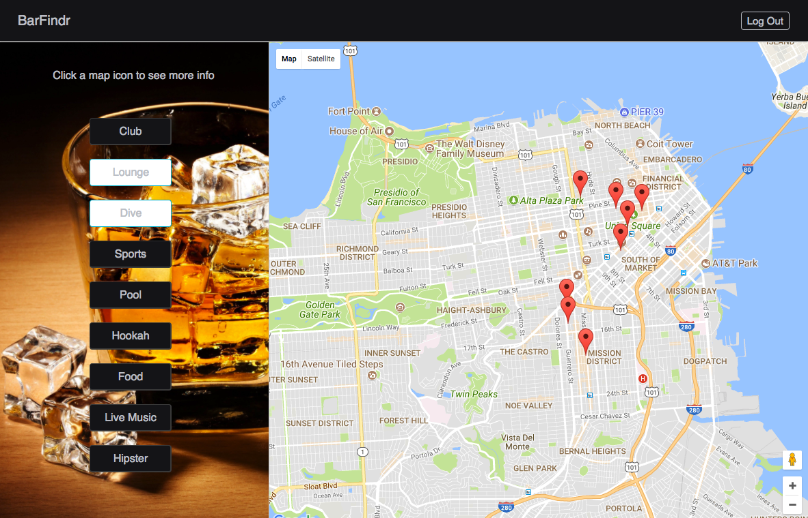

# BarFindr

[Live Demo](https://www.barfindrsf.com/#/)

BarFindr has an easy to use map interface that allows you to find bars around the city.
Search by clicking the various keyword buttons that filter the map. Then select a map icon to see more info.

I built this website using React and Redux for the frontend, and Rails for the backend.

# Usage

Click a keyword button to filter the map.

Click on a map icon to see details about the selected venue. Logged in users can comment and add or update their rating.

You can also select multiple filters to expand your results if you're feeling less picky.

# Design

The minimalistic design allows users to find what they're look for without being overwhelmed by un-related information.

The react front-end allow you to search seamlessly without full page reloads. There are only a few main components. By default the sidebar will display keyword buttons to filter the map. If a location marker is clicked, the sidebar will display the relevant information. Allowing options for the user to comment or add a rating.

If the user has never rated the location, the average star rating will be displayed. Once a user chooses a rating based on their experience, it will update the average in the database and display their personal rating.

Redux stores the state of the application, making the code clean and easily maintainable.

## Search Functionality

Selecting or unselecting each keyword search button will update the tags filter in the state (by default is an empty array). Which then calls 'add' or 'remove' actions sending a request to the server. The server then filters the results based on the tags passed in and returns the appropriate bars. If no tags are selected, the server returns all bars within the bounds of the current map viewport.

In the Sidebar I reuse the SearchButton component passing the tag name for each button.

To deselect the search button when a new one has been selected, I added a simple toggle of the state. I also needed to handle a click to the logo or 'Log Out' on the header to reset all of the buttons to 'unselected'. Since this click is in a separate component, I added the tag filters as a prop to the SearchButton. And use a componentWillReceiveProps lifecycle method to check if it has been changed to an empty array (resetting the map).

# Future Additions

### Colorized map
A customized map color scheme to match the theme.

### Geolocation
Utilize the geolocation api to display the current users location.

### Up/Down Vote
Allow users to up or down vote other users comments. This can help filter out inaccurate reviews.
